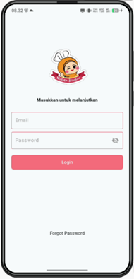
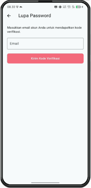
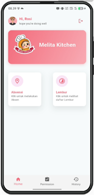
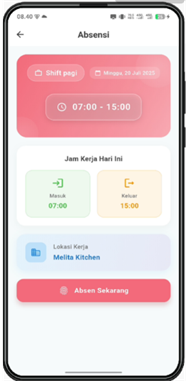
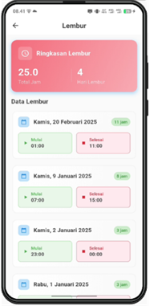
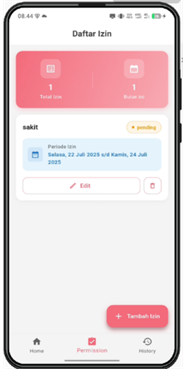
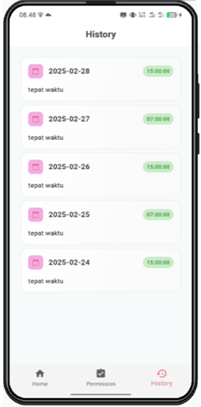

# 🚀 Absensi - Sistem Manajemen Kehadiran Karyawan
### Studi Kasus: Restoran Melita Kitchen

## 📝 Deskripsi
Sistem manajemen kehadiran karyawan ini terintegrasi dengan [backend Laravel](https://github.com/okedane/Absensi-Backend-Laravel).

## 🖥️ Fitur Utama
- ⌚ Absensi Berbasis Lokasi
- 📝 Pengajuan Izin 
- 📋 Riwayat Kehadiran
- ⏰ Manajemen Lembur
<!-- 
## 📸 Interface

Screenshots Aplikasi

### 🔐 Login

### 🔑 Reset Password

### 📊 Dashboard

### 📍 Absensi

### ⏱️ Lembur

### 📋 Izin

### 📜 Riwayat

 -->
## 📸 Interface

Screenshots Aplikasi

### 🔐 Login

  

### 🔑 Reset Password

  

### 📊 Dashboard

  

### 📍 Absensi

  

### ⏱️ Lembur

  

### 📋 Izin

  

### 📜 Riwayat

  

